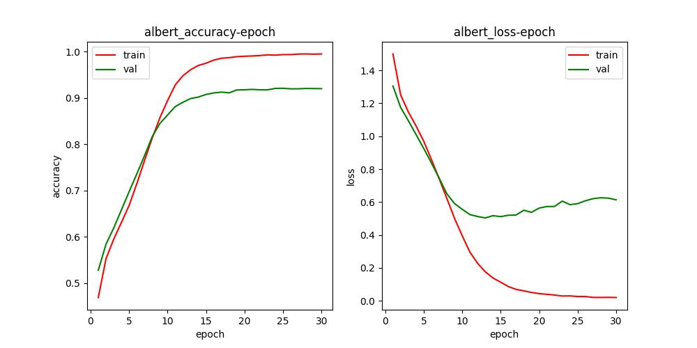
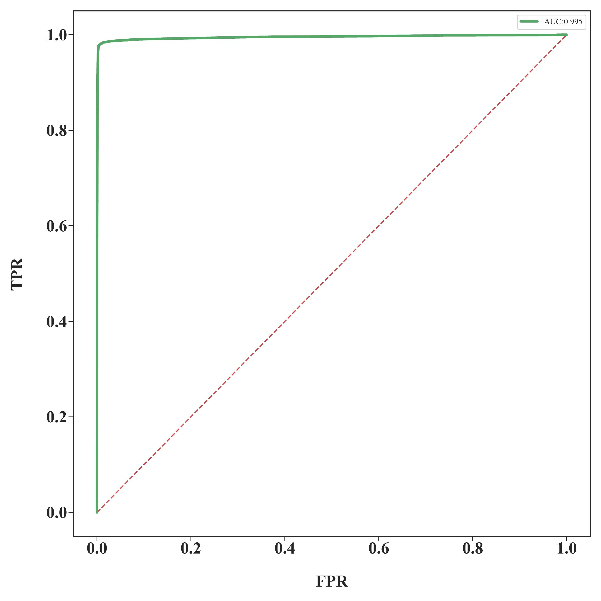
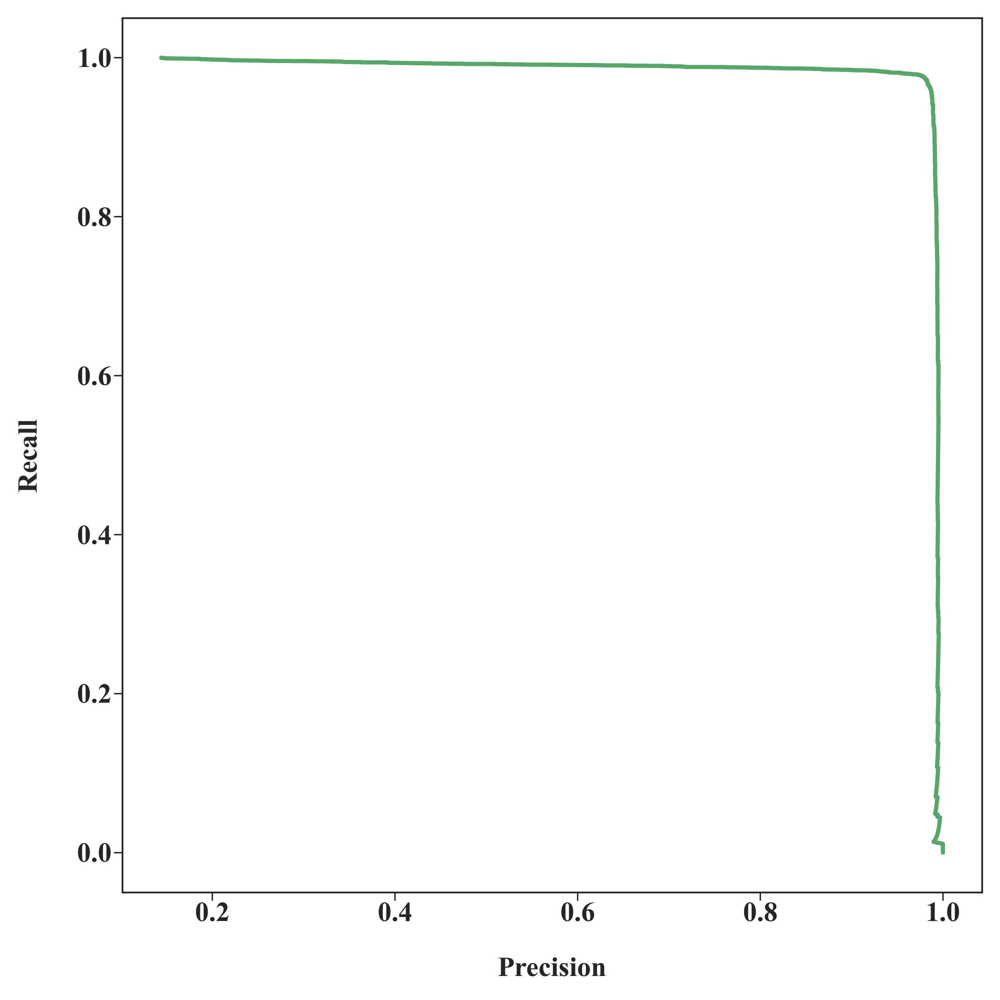
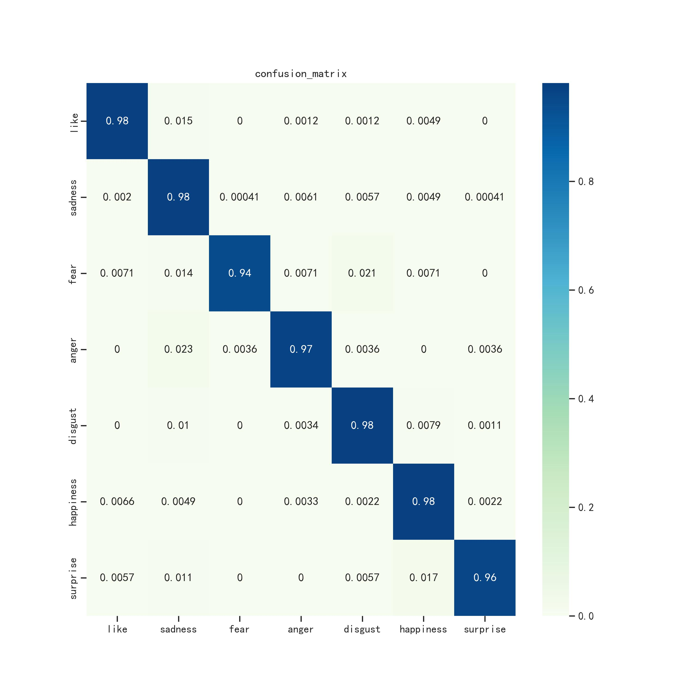

# ALBERT 情感识别系统

基于 ALBERT 预训练模型的中文文本情感识别项目，支持 7 种常见情感分类，提供命令行、模型训练与 Flask Web 可视化等多种使用方式。

## 亮点特性
- 🎯 覆盖喜欢、悲伤、恐惧、愤怒、厌恶、快乐、惊讶 7 类情感
- 🤖 采用轻量级 **ALBERT-Chinese-Small** 进行微调，推理迅速
- 📊 训练过程与评估结果可视化，便于快速对比模型表现
- 🌐 自带 Flask Web 前端，支持实时情感预测与概率分布展示

## 分支说明
- `main`：说明文档分支（当前分支）
- `Dev`：完整项目代码与示例分支（训练、推理、Web 应用等）

> **提示：** 请切换到 `Dev` 分支获取全部源代码与可运行示例。

```bash
git checkout Dev
```

## 快速开始（Dev 分支）
1. 切换到开发分支：`git checkout Dev`
2. 安装依赖（示例：Web 应用）：
   ```bash
   pip install -r requirements_web.txt
   ```
3. 运行 Flask Web 服务：
   ```bash
   python app.py
   ```
4. 打开浏览器访问 `http://localhost:5000`，输入中文文本即可查看实时情感预测与概率分布。

## 模型与数据
- 预训练模型：`albert-chinese-small`（19.2MB 轻量模型）
- 支持最大 200 个 tokens 的中文文本输入
- 输出包含情感标签（中英双语）、emoji、置信度以及各类别概率

## 训练与评估可视化

| 训练/评估曲线 | ROC 曲线 | PR 曲线 | 混淆矩阵 |
| --- | --- | --- | --- |
|  |  |  |  |

- **训练准确率与损失**：准确率曲线稳步上升、损失同步下降，表明 7 类情感任务在当前超参下能平滑收敛；中后期波动较小，说明未出现明显过拟合。
- **ROC 曲线**：多条曲线紧贴左上角，微平均（micro）与宏平均（macro）都处于高值区间，提示模型对各情感类别都有较强的区分能力，AUC 越接近 1 表现越好。
- **PR 曲线**：在高召回率区域依然维持较高精确率，说明即便在类别轻度不均衡的情况下，模型仍能稳定捕捉目标情感；曲线越靠近右上角，代表在实际部署中漏判/误判风险更低。
- **混淆矩阵**：对角线深色块表示该类别预测准确度高；若发现某些情感（如“悲伤”与“厌恶”）相邻区域颜色较深，可考虑增加相应数据或调整决策阈值以进一步降低混淆。

## 项目结构（Dev 分支）
```
Albert-Sentiment-Analysis/
├── app.py                # Flask Web 服务入口
├── nets.py               # 模型结构定义
├── predict.py            # 文本预测脚本
├── train_bert.py         # 训练脚本
├── templates/            # Web 前端模板
├── images/               # 训练评估可视化结果
├── albert-chinese-small/ # 预训练模型文件
└── requirements_web.txt  # Web 端依赖
```

## 许可证

MIT License
